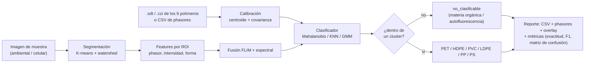

# napari-mp-classifier

Clasificación automática de **microplásticos recalcitrantes** teñidos con Nile Red,
contra 6 polímeros de referencia (♳ PET, ♴ HDPE, ♵ PVC, ♶ LDPE, ♷ PP, ♸ PS), usando
**diagramas de phasores** de dos modalidades de microscopía de fluorescencia:

- **Espectral (λ-stack)** — espectro de emisión de Nile Red.
- **FLIM (dominio temporal)** — tiempo de vida de fluorescencia de Nile Red.

Corresponde a la Fig. 5 del póster *"Clasificación automática de microplásticos
recalcitrantes basado en microscopía de fluorescencia espectral y FLIM"* (UNER/CONICET —
LAMAE/LaSBI).

> **Diferenciación frente al estado del arte:** ningún antecedente combina FLIM +
> espectral simultáneamente (Sancataldo 2020 usa solo FLIM; Meyers 2022 solo RGB; FIMAP
> 2025 solo espectral/NN). Ver [`docs/ANTECEDENTES.md`](docs/ANTECEDENTES.md).

## Estado

| Fase | Descripción | Estado |
|---|---|---|
| 0 | Diseño y evaluación de dependencias | ✔ ([`docs/FASE_0_EVALUACION.md`](docs/FASE_0_EVALUACION.md)) |
| 1 | Datos sintéticos + clasificador base (`calibracion`, `clasificador`, `metricas`) | ✔ — 27 tests en verde; resultados en [`docs/RESULTADOS_FASE1.md`](docs/RESULTADOS_FASE1.md) |
| 2 | Segmentación (`segmentacion`, `features`) | pendiente |
| 3 | Pipeline completo + reportes + CLI | pendiente |
| 4 | Integración napari | pendiente |
| 5 | Validación (muestras ambientales / celulares), robustez, documentación | pendiente |

## Instalación

```bash
pip install -e ".[dev]"
pytest
```

Python 3.11+. Depende de [`phasorpy`](https://www.phasorpy.org) para la lectura de
formatos crudos (`.sdt`, `.czi`, …) y el cálculo de phasores — **no se reimplementa nada
de eso**.

## Flujo de datos



Detalle en [`docs/PIPELINE.md`](docs/PIPELINE.md).

## Ejemplo end-to-end (Fase 1, datos sintéticos)

```python
import numpy as np
from napari_mp_classifier import Calibracion, ClasificadorPhasor
from napari_mp_classifier.metricas import evaluar_clasificacion

# datos sintéticos de ejemplo (ver tests/datos_sinteticos.py)
import sys; sys.path.insert(0, "tests")
from datos_sinteticos import generar_calibracion, generar_particulas

df = generar_calibracion("flim", n_por_polimero=60)
cal = Calibracion.desde_dataframe(df, columnas=["g_flim", "s_flim"])

clf = ClasificadorPhasor(cal, estrategia="centroide", confianza=0.99).entrenar()

X, y = generar_particulas("flim", n_por_polimero=40, n_no_clasificables=60)
pred = clf.predecir(X)

print(evaluar_clasificacion(y, pred).resumen())
```

## Documentación

- [`docs/ANTECEDENTES.md`](docs/ANTECEDENTES.md) — las 6 referencias y su influencia de diseño.
- [`docs/FASE_0_EVALUACION.md`](docs/FASE_0_EVALUACION.md) — evaluación de `phasorpy` / `napari-phasors`.
- [`docs/PIPELINE.md`](docs/PIPELINE.md) — flujo de datos y estado por etapa.
- [`docs/RESULTADOS_FASE1.md`](docs/RESULTADOS_FASE1.md) — prueba del clasificador sobre datos sintéticos.
- [`docs/FORMATO_DATOS.md`](docs/FORMATO_DATOS.md) — formatos de entrada/salida.
- [`docs/PREGUNTAS_DATOS.md`](docs/PREGUNTAS_DATOS.md) — pendientes con el equipo.
- [`docs/MANUAL_USUARIO.md`](docs/MANUAL_USUARIO.md) — instalación y uso.
- [`docs/BITACORA.md`](docs/BITACORA.md) — registro de avance.

## Licencia

MIT.
