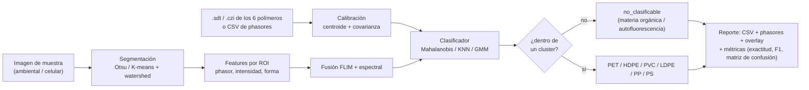

# napari-mp-classifier

Clasificación automática de **microplásticos recalcitrantes** teñidos con Nile Red,
contra 6 polímeros de referencia (♳ PET, ♴ HDPE, ♵ PVC, ♶ LDPE, ♷ PP, ♸ PS), usando
**diagramas de phasores** de dos modalidades de microscopía de fluorescencia:

- **Espectral (λ-stack)** — espectro de emisión de Nile Red.
- **FLIM (dominio temporal)** — tiempo de vida de fluorescencia de Nile Red.

Corresponde a la Fig. 5 del póster *"Clasificación automática de microplásticos
recalcitrantes basado en microscopía de fluorescencia espectral y FLIM"* (UNER/CONICET —
LAMAE/LaSBI).

> **Diferenciación frente al estado del arte:** ningún antecedente combina FLIM +
> espectral simultáneamente (Sancataldo 2020 usa solo FLIM; Meyers 2022 solo RGB; FIMAP
> 2025 solo espectral/NN). Ver [`docs/ANTECEDENTES.md`](docs/ANTECEDENTES.md).

## Estado

| Fase | Descripción | Estado |
|---|---|---|
| 0 | Diseño y evaluación de dependencias | ✔ ([`docs/FASE_0_EVALUACION.md`](docs/FASE_0_EVALUACION.md)) |
| 1 | Datos sintéticos + clasificador base (`calibracion`, `clasificador`, `metricas`) | ✔ — resultados en [`docs/RESULTADOS_FASE1.md`](docs/RESULTADOS_FASE1.md) |
| 2 | Segmentación + features (`segmentacion`, `features`) | ✔ — IoU 0,81 (nivel FIMAP); resultados en [`docs/RESULTADOS_FASE2.md`](docs/RESULTADOS_FASE2.md) |
| 3 | Pipeline + reportes + CLI + fusión + desmezcla (`pipeline`, `fusion`, `desmezcla`, `cli`) | ✔ — resultados en [`docs/RESULTADOS_FASE3.md`](docs/RESULTADOS_FASE3.md) |
| 4 | Plugin de napari (`napari_integracion`: widget de clasificación + phasor plot con back-projection) | ✔ — resultados en [`docs/RESULTADOS_FASE4.md`](docs/RESULTADOS_FASE4.md) |
| 5 | Validación (muestras ambientales / celulares), robustez, documentación | pendiente |

## Instalación

```bash
pip install -e ".[dev]"
pytest
```

Python 3.11+ (por `phasorpy >= 0.12`). Depende de [`phasorpy`](https://www.phasorpy.org)
para la lectura de formatos crudos (`.sdt`, `.czi`, …) y el cálculo de phasores — **no se
reimplementa nada de eso**.

Para el plugin de napari (Fase 4) hace falta un entorno con Python 3.12 + Qt:

```bash
conda create -n napari-mp-env python=3.12 && conda activate napari-mp-env
pip install -e ".[dev,napari]"
napari                     # Plugins → Clasificador de microplásticos por phasores
```

## Flujo de datos



Detalle en [`docs/PIPELINE.md`](docs/PIPELINE.md).

## Ejemplo end-to-end (Fase 1, datos sintéticos)

```python
import numpy as np
from napari_mp_classifier import Calibracion, ClasificadorPhasor
from napari_mp_classifier.metricas import evaluar_clasificacion

# datos sintéticos de ejemplo (ver tests/datos_sinteticos.py)
import sys; sys.path.insert(0, "tests")
from datos_sinteticos import generar_calibracion, generar_particulas

df = generar_calibracion("flim", n_por_polimero=60)
cal = Calibracion.desde_dataframe(df, columnas=["g_flim", "s_flim"])

clf = ClasificadorPhasor(cal, estrategia="centroide", confianza=0.99).entrenar()

X, y = generar_particulas("flim", n_por_polimero=40, n_no_clasificables=60)
pred = clf.predecir(X)

print(evaluar_clasificacion(y, pred).resumen())
```

## Ejemplo end-to-end (Fase 2, imagen sintética)

```python
import sys; sys.path.insert(0, "tests")
from datos_sinteticos import generar_imagen_muestra, generar_calibracion, _columnas
from napari_mp_classifier import Calibracion, ClasificadorPhasor, segmentar
from napari_mp_classifier.features import extraer_features, matriz_features

canales, verdad = generar_imagen_muestra(semilla=0)
labels = segmentar(canales["intensidad"],
                   g_flim=canales["g_flim"], s_flim=canales["s_flim"],
                   g_esp=canales["g_esp"], s_esp=canales["s_esp"])   # -> imagen de labels

feats = extraer_features(labels, canales["intensidad"],
                         g_flim=canales["g_flim"], s_flim=canales["s_flim"],
                         g_esp=canales["g_esp"], s_esp=canales["s_esp"])

df = generar_calibracion("fusion", n_por_polimero=60)
cal = Calibracion.desde_dataframe(df, columnas=_columnas("fusion"))
clf = ClasificadorPhasor(cal, estrategia="knn", confianza=0.99)
clf.entrenar(df[_columnas("fusion")].to_numpy(), df["polimero"].to_numpy())

X, columnas = matriz_features(feats, "fusion")
feats["polimero_predicho"] = clf.predecir(X)
print(feats[["area_px", "g_flim", "s_flim", "polimero_predicho"]])
```

Demo completa con figuras: `python ejemplos/demo_fase2.py`.

## Pipeline completo (Fase 3)

```python
from napari_mp_classifier import Calibracion, analizar_muestra
from napari_mp_classifier.reportes import generar_reporte

# canales: dict con 'intensidad' + phasores por píxel; df: mediciones de calibración
resultado = analizar_muestra(
    canales, Calibracion.desde_dataframe(df, columnas=["g_flim", "s_flim", "g_esp", "s_esp"]),
    estrategia="knn",
    mediciones_calibracion=(df[["g_flim", "s_flim", "g_esp", "s_esp"]].to_numpy(), df["polimero"].to_numpy()),
)
generar_reporte(resultado, "resultados/", canales=canales)   # CSV + métricas + figuras
```

O desde la terminal:

```bash
napari-mp-classifier classify muestra.npz --calibracion calibracion.csv --salida resultados/
```

Demo con fusión y desmezcla: `python ejemplos/demo_fase3.py`.

## Documentación

- [`docs/ANTECEDENTES.md`](docs/ANTECEDENTES.md) — las 6 referencias y su influencia de diseño.
- [`docs/FASE_0_EVALUACION.md`](docs/FASE_0_EVALUACION.md) — evaluación de `phasorpy` / `napari-phasors`.
- [`docs/PIPELINE.md`](docs/PIPELINE.md) — flujo de datos y estado por etapa.
- [`docs/RESULTADOS_FASE1.md`](docs/RESULTADOS_FASE1.md) — prueba del clasificador sobre datos sintéticos.
- [`docs/RESULTADOS_FASE2.md`](docs/RESULTADOS_FASE2.md) — segmentación + features + clasificación por ROI.
- [`docs/RESULTADOS_FASE3.md`](docs/RESULTADOS_FASE3.md) — pipeline completo, fusión, desmezcla, CLI.
- [`docs/RESULTADOS_FASE4.md`](docs/RESULTADOS_FASE4.md) — plugin de napari (widget + phasor plot con back-projection).
- [`docs/FORMATO_DATOS.md`](docs/FORMATO_DATOS.md) — formatos de entrada/salida.
- [`docs/SPECTRAL_UNMIXING.md`](docs/SPECTRAL_UNMIXING.md) — unmixing de λ-stacks (opciones napari/Python).
- [`docs/PREGUNTAS_DATOS.md`](docs/PREGUNTAS_DATOS.md) — pendientes con el equipo.
- [`docs/MANUAL_USUARIO.md`](docs/MANUAL_USUARIO.md) — instalación y uso.
- [`docs/BITACORA.md`](docs/BITACORA.md) — registro de avance.

## Licencia

MIT.
