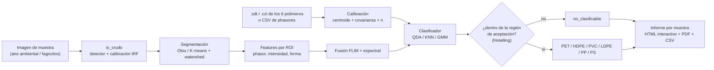

# napari-mp-classifier

Clasificación automática de **microplásticos (MP) recalcitrantes** teñidos con Nile Red
contra 6 polímeros de referencia (♳ PET, ♴ HDPE, ♵ PVC, ♶ LDPE, ♷ PP, ♸ PS), usando
**diagramas de phasores** de dos modalidades de microscopía de fluorescencia:

- **Espectral (λ-stack)**: espectro de emisión de Nile Red (phasor espectral).
- **FLIM (dominio temporal)**: tiempo de vida de fluorescencia de Nile Red (phasor FLIM).

> **Diferenciación frente al estado del arte:** ningún antecedente combina FLIM y espectral
> simultáneamente (Sancataldo 2020 usa solo FLIM; Meyers 2022 solo RGB; FIMAP 2025 solo
> espectral/NN). Ver [`docs/ANTECEDENTES.md`](docs/ANTECEDENTES.md).

## Marco institucional

Este software se desarrolla en el marco de la **Beca del PID 6303** (Proyecto de
Investigación y Desarrollo, Universidad Nacional de Entre Ríos):

> **«Microplásticos atmosféricos inhalables. Métodos innovadores para caracterizar muestras
> de aire ambiental y biodistribución bronquioalveolar basados en Microscopía de
> fluorescencia multimodal»**
>
> Director: **Dr. Luis Pablo Schierloh**

Implementa la **Fig. 5** del póster *«Clasificación automática de microplásticos
recalcitrantes basado en microscopía de fluorescencia espectral y FLIM»*.

**Autores del trabajo:** Narella Corona¹\*, Matías Ríos¹\*, Alejandro Escobar-Guardia¹,
Julieta Moreno², Juan Etchart², Carolina Galleto¹·², Martín Blettler², Pablo Schierloh¹·²·³.

1. Departamento de Biología, Facultad de Ingeniería (FIUNER), Universidad Nacional de Entre
   Ríos (UNER).
2. **LAMAE** (*Laboratorio de Microscopía Aplicada a Estudios Moleculares y Celulares*),
   Instituto de Investigación y Desarrollo en Bioingeniería y Bioinformática (**IBB**),
   UNER–CONICET.
3. **LaSBI** (*Laboratorio de Salud y Bienestar Integral*), FIUNER, UNER.

\* Igual contribución.

**Desarrollo del software:** Matías Ríos, estudiante de la Licenciatura en Bioinformática
(FIUNER).

## Contexto científico

**Fundamento.** El colorante hidrofóbico **Nile Red (NR)** tiñe los microplásticos
recalcitrantes. Su respuesta, es decir el espectro de emisión y el tiempo de vida de
fluorescencia, depende de la polaridad y la rigidez de la matriz polimérica, y por eso
**difiere entre polímeros**. Al caracterizar esa respuesta con microscopía multimodal, cada
uno de los 6 polímeros de referencia ocupa una **región separable (cluster)** en el plano
de phasores. La Fig. 2 del póster muestra la identificación por FLIM y phasores (cf.
Sancataldo et al. 2020). La Fig. 5 **suma la modalidad espectral** y la convierte en un
clasificador automático.

**Qué resuelve.** Usa la firma de referencia (los 6 clusters calibrados) para clasificar
partículas desconocidas en **matrices complejas**. La clave es distinguir la señal de NR-MP
de todo lo demás:

- **Muestras ambientales** (aire, agua), con materia orgánica y otras partículas
  fluorescentes de fondo (celulosa, quitina, restos biológicos).
- **Cultivos primarios de fagocitos humanos**: monocitos (Mo) y neutrófilos (PMN) que
  fagocitaron MP. Ahí hay que separar la señal de NR-MP fagocitado de la
  **autofluorescencia celular** (cf. Park et al. 2020). Es la base del estudio de
  biodistribución bronquioalveolar del PID.

Lo que cae fuera de todos los clusters conocidos se marca **`no_clasificable`** en vez de
forzar una asignación. Es la barrera contra los falsos positivos de «plástico».

**Calibración con polímero envejecido.** Los 6 estándares se miden sobre polímero
degradado de forma controlada (**abrasión + H₂O₂**, opcionalmente **UV**), para que
calibración y muestra ambiental estén en el mismo estado de meteorización. Ver
[`docs/DECISION_CALIBRACION.md`](docs/DECISION_CALIBRACION.md).

## Estado actual del proyecto (octubre 2026)

| Área | Estado |
|---|---|
| Lectura de datos crudos (`.sdt` Becker & Hickl, `.czi` Zeiss) | ✔ Probada con datos reales de LAMAE; elección de detector en `.sdt` multi-detector |
| Calibración FLIM | ✔ **Con IRF, como SPCImage** (IRF sintética del flanco o medida). Validada por simulación: error 2–6 % entre 1 y 4 ns |
| Segmentación y features por partícula | ✔ IoU 0,81 sobre datos sintéticos (FIMAP: 0,877) |
| Clasificador (centroide/QDA, KNN, GMM) con rechazo «no clasificable» | ✔ Corregido tras la auditoría de octubre 2026 (umbral de Hotelling, QDA, NaN) |
| Fusión FLIM + espectral | ✔ Por ROI (emparejamiento óptimo) y por decisión |
| Informe por muestra (HTML interactivo + PDF) | ✔ [`docs/INFORMES.md`](docs/INFORMES.md) |
| CLI y plugin de napari | ✔ |
| Pruebas automáticas | ✔ 143 tests (137 sin napari + 6 de napari) |
| **Calibración real de los 6 polímeros** | ⏳ **Pendiente de datos del equipo**: hoy no se puede clasificar una muestra real |
| Validación con muestras reales (aire ambiental, fagocitos) | ⏳ Pendiente, depende de la calibración |

**Datos reales disponibles hoy:** una partícula de polietileno (PE) teñida con Nile Red,
adquirida en FLIM (`.sdt`, dos detectores) y λ-stack (`.czi`). Con ellos se genera un
**informe de caracterización**: área 214,5 µm², máximo de emisión 541 nm y τφ = 2,69 ns /
τm = 2,95 ns con FLIM calibrado. No es una clasificación. Detalle en
[`docs/RESULTADOS_PRUEBA_LAMAE.md`](docs/RESULTADOS_PRUEBA_LAMAE.md).

**Qué falta del equipo** ([`docs/PREGUNTAS_DATOS.md`](docs/PREGUNTAS_DATOS.md)):
1. La calibración de los 6 polímeros envejecidos (≥ 15 partículas por polímero).
2. Qué banda de emisión registra cada detector FLIM.
3. Una IRF medida por sesión, que es opcional pero recomendable.
4. FLIM y espectral del mismo campo, para fusionar por partícula.
5. Confirmar si el PE de la prueba es HDPE o LDPE.

## Resultados sobre datos sintéticos

Los clusters sintéticos usan tiempos de vida y posiciones espectrales *ilustrativos*, no
medidos. La auditoría de octubre de 2026 ([`docs/AUDITORIA.md`](docs/AUDITORIA.md)) mostró
que el escenario sintético original es demasiado fácil. Por eso se informan dos escenarios:

| Escenario (fusión FLIM + espectral) | Exactitud balanceada | F1 polímeros | Polímero rechazado por error | Materia orgánica aceptada |
|---|---|---|---|---|
| Original: clusters isotrópicos, materia orgánica lejos de todo | 0,99 (KNN) | 1,00 | 0,3 % | 1,1 % |
| Original, con la estrategia por defecto (QDA + Hotelling) | 0,94 | 0,97 | 6,7 % ¹ | 0,3 % |
| **Realista**: covarianzas distintas, 15 mediciones por polímero, autofluorescencia cerca de un polímero | **0,92** (QDA + Hotelling) | **0,93** | **1,3 %** | **51 %** |

Media de 10 (original) y 12 (realista) semillas, `confianza = 0,99`; detalle y desvíos en
[`docs/AUDITORIA.md`](docs/AUDITORIA.md). ¹ En ese escenario las partículas de prueba son
más ruidosas que la calibración (0,025 vs. 0,02); el umbral de Hotelling lo detecta y
rechaza más. Con datos reales pasa lo mismo si la muestra tiene menos fotones o distinto
envejecimiento que la calibración.

En el escenario realista, la autofluorescencia que cae cerca de un polímero no se separa
solo con un umbral de distancia (AUROC del rechazo 0,93). Hace falta elegir la `confianza`
con datos de validación reales y sumar evidencia adicional. Es la principal línea de
trabajo pendiente.

**La fusión FLIM + espectral no queda por debajo de ninguna modalidad sola** en ningún
escenario (exactitud balanceada, QDA + Hotelling). Supera con claridad a FLIM solo (0,94 vs.
0,89 en el original y 0,92 vs. 0,84 en el realista). Frente al espectral solo, en cambio, la
ventaja en el escenario realista es marginal (0,917 vs. 0,912, dentro del desvío). Para
sostener la tesis del póster con datos reales hace falta que el FLIM aporte información
que el espectral no tiene.

## Instalación

```bash
pip install -e ".[dev]"
pytest
```

Requiere Python 3.11 o superior y [`phasorpy`](https://www.phasorpy.org) ≥ 0.12, que se usa
para leer los formatos crudos y calcular los phasores; esa parte **no se reimplementa**.
El PDF de los informes se genera con Chrome o Chromium en modo headless, si están
instalados.

Para el plugin de napari hace falta un entorno con Python 3.12 y Qt:

```bash
conda create -n napari-mp-env python=3.12 && conda activate napari-mp-env
pip install -e ".[dev,napari]"
napari                     # Plugins → Clasificador de microplásticos por phasores
```

## Uso rápido

**Desde la terminal** (muestra en `.npz` con `intensidad` y los phasores por píxel):

```bash
napari-mp-classifier classify muestra.npz --calibracion calibracion.csv \
    --salida resultados/ --nombre "Filtro aire 03" --escala-um-px 0.077
```

Escribe el CSV de asignaciones, las métricas, las figuras y el **informe por muestra**
`informe.html` + `informe.pdf`. Opciones útiles:
- `--modalidad flim|espectral` restringe el análisis a una modalidad.
- `--calibracion cal.json` usa una calibración guardada con `Calibracion.guardar_json`.
- `--sin-pdf` y `--sin-informe` omiten el PDF o el informe completo.

**Desde Python:**

```python
from napari_mp_classifier import Calibracion, analizar_muestra
from napari_mp_classifier.informe_html import generar_informe_html
from napari_mp_classifier.io_crudo import phasores_desde_sdt, phasores_desde_czi

flim = phasores_desde_sdt("muestra.sdt", calibrar_irf=True)   # detector con más fotones
esp = phasores_desde_czi("muestra.czi")

cal = Calibracion.cargar_json("calibracion_6_polimeros.json")
resultado = analizar_muestra({"intensidad": esp.intensidad, "g_esp": esp.g, "s_esp": esp.s},
                             cal, estrategia="centroide", escala_um_px=0.0767)
generar_informe_html(resultado, {"intensidad": esp.intensidad}, "informe.html",
                     nombre_muestra="Filtro aire 03", archivo="muestra.czi")
```

**Ejemplos listos para correr:**

| Script | Qué hace |
|---|---|
| `ejemplos/demo_informe.py` | Informes HTML/PDF de dos muestras sintéticas (control y «ambiental») |
| `ejemplos/informe_lamae.py` | Informe de caracterización con los datos reales de LAMAE (requiere `ejemplo_lamae/`) |
| `ejemplos/demo_lamae.py` | Lectura de `.sdt`/`.czi` reales, calibración FLIM con IRF, segmentación |
| `ejemplos/demo_fase1.py` … `demo_fase5.py` | Recorrido por fases sobre datos sintéticos |
| `ejemplos/notebook_demo.ipynb` | Recorrido end-to-end en Jupyter |

## Flujo de datos


```mermaid
flowchart LR
    C[".sdt / .czi de los 6 polímeros<br/>o CSV de phasores"] --> CAL["Calibración<br/>centroide + covarianza + n"]
    M["Imagen de muestra<br/>(aire ambiental / fagocitos)"] --> IO["io_crudo<br/>detector + calibración IRF"]
    IO --> SEG["Segmentación<br/>Otsu / K-means + watershed"]
    SEG --> FEAT["Features por ROI<br/>phasor, intensidad, forma"]
    FEAT --> FUS["Fusión FLIM + espectral"]
    CAL --> CLF["Clasificador<br/>QDA / KNN / GMM"]
    FUS --> CLF
    CLF --> R{"¿dentro de la región<br/>de aceptación?<br/>(Hotelling)"}
    R -- no --> NC["no_clasificable"]
    R -- sí --> P["PET / HDPE / PVC / LDPE / PP / PS"]
    NC --> REP["Informe por muestra<br/>HTML interactivo + PDF + CSV"]
    P --> REP
```

## Estructura del paquete

```
src/napari_mp_classifier/
  io_crudo.py          # .sdt/.czi → phasor por píxel (phasorpy); detectores; calibración IRF
  calibracion_flim.py  # IRF sintética del flanco (SPCImage) y calibración z / z_IRF
  calibracion.py       # firma de referencia de los 6 polímeros; guardar/cargar JSON
  segmentacion.py      # ROIs por umbral / K-means + watershed
  features.py          # phasor, intensidad y forma por ROI
  clasificador.py      # QDA / KNN / GMM + regla «no clasificable» (Hotelling)
  fusion.py            # fusión FLIM + espectral por ROI o por decisión
  desmezcla.py         # fracción NR-MP vs autofluorescencia (phasorpy.component)
  pipeline.py          # imagen → partículas clasificadas
  metricas.py          # exactitud, exactitud balanceada, precisión, recall, F1, IoU
  reportes.py          # CSV, figuras de publicación
  informe_html.py      # informe por muestra (HTML interactivo + PDF)
  glosario.py          # glosario y ayudas «?» de los informes
  cli.py               # napari-mp-classifier classify …
  napari_integracion/  # widget + phasor plot con back-projection
```

## Documentación

| Documento | Contenido |
|---|---|
| [`docs/MANUAL_USUARIO.md`](docs/MANUAL_USUARIO.md) | Instalación y uso |
| [`docs/INFORMES.md`](docs/INFORMES.md) | Informe por muestra: estructura, estado del análisis, PDF |
| [`docs/CALIBRACION_FLIM.md`](docs/CALIBRACION_FLIM.md) | Calibración FLIM con IRF (SPCImage) y su validación |
| [`docs/AUDITORIA.md`](docs/AUDITORIA.md) | Auditoría de octubre 2026: hallazgos, correcciones y pendientes |
| [`docs/RESULTADOS_PRUEBA_LAMAE.md`](docs/RESULTADOS_PRUEBA_LAMAE.md) | Primera prueba con datos reales |
| [`docs/PREGUNTAS_DATOS.md`](docs/PREGUNTAS_DATOS.md) | Pendientes con el equipo |
| [`docs/ANTECEDENTES.md`](docs/ANTECEDENTES.md) | Las 6 referencias y su influencia en el diseño |
| [`docs/FASE_0_EVALUACION.md`](docs/FASE_0_EVALUACION.md) | Evaluación de `phasorpy` / `napari-phasors` |
| [`docs/PIPELINE.md`](docs/PIPELINE.md) | Flujo de datos por etapa |
| [`docs/DECISION_CALIBRACION.md`](docs/DECISION_CALIBRACION.md) | Calibración sobre polímero envejecido |
| [`docs/FORMATO_DATOS.md`](docs/FORMATO_DATOS.md) | Formatos de entrada y salida |
| [`docs/SPECTRAL_UNMIXING.md`](docs/SPECTRAL_UNMIXING.md) | Desmezcla de λ-stacks |
| `docs/RESULTADOS_FASE1.md` … `RESULTADOS_FASE5.md` | Resultados por fase (datos sintéticos) |
| [`docs/BITACORA.md`](docs/BITACORA.md) | Registro de avance |

## Cómo citar

Corona N., Ríos M., Escobar-Guardia A., Moreno J., Etchart J., Galleto C., Blettler M.,
Schierloh P. *Clasificación automática de microplásticos recalcitrantes basado en
microscopía de fluorescencia espectral y FLIM.* FIUNER / LAMAE (IBB, UNER–CONICET) /
LaSBI. PID 6303, UNER.

## Licencia

MIT.
