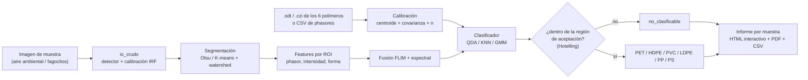

<div align="center">


# Napari-MP 1.0

**Clasificación automática de microplásticos recalcitrantes mediante microscopía de
fluorescencia espectral y FLIM**

<sup>1</sup> Departamento de Biología, Facultad de Ingeniería (**FIUNER**), Universidad Nacional de Entre Ríos (**UNER**)<br>
<sup>2</sup> **LAMAE**, Laboratorio de Microscopía Aplicada a Estudios Moleculares y Celulares.
**IBB**, Instituto de Investigación y Desarrollo en Bioingeniería y Bioinformática,
UNER – **CONICET** (Consejo Nacional de Investigaciones Científicas y Técnicas)<br>
<sup>3</sup> **LaSBI**, Laboratorio de Salud y Bienestar Integral, FIUNER, UNER


</div>

---

## Resumen

**Napari-MP** es un módulo de análisis que identifica **microplásticos (MP)
recalcitrantes** teñidos con **Nile Red** y los asigna a uno de seis polímeros de referencia:
♳ PET, ♴ HDPE, ♵ PVC, ♶ LDPE, ♷ PP y ♸ PS. Para eso usa **diagramas de phasores** de dos
modalidades de microscopía de fluorescencia:

- **Espectral (λ-stack)**: espectro de emisión de Nile Red.
- **FLIM (dominio temporal)**: tiempo de vida de fluorescencia de Nile Red.

Las partículas cuya firma no corresponde a ningún polímero calibrado se informan como
**no clasificables**, sin forzar una asignación. El resultado de cada muestra es un informe
técnico (HTML interactivo y PDF) con composición, localización, firma de fluorescencia y
trazabilidad del análisis.

> **Versión 1.0, en desarrollo.** La versión 1.0 todavía no está cerrada: falta la
> calibración con los seis polímeros reales y la validación con muestras reales (ver
> [Estado del desarrollo](#estado-del-desarrollo-octubre-2026)). El paquete de Python y
> la línea de comandos se llaman `napari-mp-classifier` (versión `1.0.0.dev0`).

> **Aporte frente al estado del arte.** Ningún antecedente relevado combina FLIM y
> espectral en simultáneo: Sancataldo et al. (2020) usan solo FLIM, Meyers et al. (2022)
> solo RGB y FIMAP (2025) solo espectral con redes neuronales. Ver
> [`docs/ANTECEDENTES.md`](docs/ANTECEDENTES.md).

## Marco institucional

| Ítem | Detalle |
|---|---|
| **Proyecto** | PID 6303 — *«Microplásticos atmosféricos inhalables. Métodos innovadores para caracterizar muestras de aire ambiental y biodistribución bronquioalveolar basados en Microscopía de fluorescencia multimodal»* |
| **Institución** | UNER |
| **Director** | Dr. Luis Pablo Schierloh |
| **Contexto** | Beca del PID 6303 |
| **Trabajo asociado** | Póster *«Clasificación automática de microplásticos recalcitrantes basado en microscopía de fluorescencia espectral y FLIM»*. Este software implementa su Fig. 5 |
| **Desarrollo del software** | Matías Ríos, estudiante de la Licenciatura en Bioinformática (FIUNER) |
| **Versión** | 1.0, en desarrollo |

### Equipo

| Autor/a | Filiación |
|---|---|
| Narella Corona \* | 1 |
| Matías Ríos \* | 1 |
| Alejandro Escobar-Guardia | 1 |
| Julieta Moreno | 2 |
| Juan Etchart | 2 |
| Carolina Galleto | 1, 2 |
| Martín Blettler | 2 |
| Pablo Schierloh | 1, 2, 3 |

\* Igual contribución. Filiaciones numeradas según el encabezado.

## Fundamento científico

**Principio de medición.** El colorante hidrofóbico Nile Red tiñe los microplásticos
recalcitrantes. Su espectro de emisión y su tiempo de vida de fluorescencia dependen de la
polaridad y la rigidez de la matriz polimérica, y por eso **difieren entre polímeros**.
Representada en el plano de phasores, la respuesta de cada uno de los seis polímeros de
referencia ocupa una **región separable** (cluster). La Fig. 2 del póster muestra la
identificación por FLIM y phasores (cf. Sancataldo et al. 2020). La Fig. 5 incorpora la
modalidad espectral y la convierte en un clasificador automático.

**Problema que aborda.** La firma de referencia (los seis clusters calibrados) se usa para
clasificar partículas desconocidas en **matrices complejas**, donde hay que separar la
señal de Nile Red unido a MP de otras fuentes de fluorescencia:

- **Muestras ambientales** (aire, agua): materia orgánica y partículas fluorescentes de
  fondo, como celulosa, quitina y restos biológicos.
- **Cultivos primarios de fagocitos humanos** (monocitos y neutrófilos) que fagocitaron
  MP, donde se suma la **autofluorescencia celular** (cf. Park et al. 2020). Es la base del
  estudio de biodistribución bronquioalveolar del PID.

**Calibración sobre polímero envejecido.** Los seis estándares se miden sobre polímero
degradado de forma controlada (abrasión + H₂O₂, opcionalmente UV), para que calibración y
muestra ambiental estén en el mismo estado de meteorización. Ver
[`docs/DECISION_CALIBRACION.md`](docs/DECISION_CALIBRACION.md).

## Estado del desarrollo (octubre 2026)

| Componente | Estado |
|---|---|
| Lectura de datos crudos (`.sdt` Becker & Hickl, `.czi` Zeiss) | ✔ Probada con datos reales de LAMAE. Elección de detector en `.sdt` con varios detectores |
| Calibración FLIM | ✔ Con IRF, al estilo SPCImage. Validada por simulación: error de 2 a 6 % entre 1 y 4 ns |
| Segmentación y features por partícula | ✔ IoU 0,81 sobre datos sintéticos (referencia FIMAP: 0,877) |
| Clasificador con rechazo «no clasificable» | ✔ QDA con umbral de Hotelling (por defecto), KNN y GMM |
| Fusión FLIM + espectral | ✔ Por partícula (emparejamiento óptimo) y por decisión |
| Informe por muestra (HTML interactivo + PDF) | ✔ [`docs/INFORMES.md`](docs/INFORMES.md) |
| Interfaz de línea de comandos y plugin de napari | ✔ |
| Pruebas automáticas | ✔ 143 tests (137 generales y 6 del plugin de napari) |
| Auditoría interna del código y la validación | ✔ [`docs/AUDITORIA.md`](docs/AUDITORIA.md) |
| **Calibración real de los seis polímeros** | ⏳ Pendiente de adquisición. Sin ella no se pueden clasificar muestras reales |
| Validación con muestras reales (aire ambiental, fagocitos) | ⏳ Pendiente, depende de la calibración |

**Datos reales procesados hasta la fecha.** Una partícula de polietileno teñida con Nile
Red (63×/1,4, excitación 440 nm), adquirida en FLIM (`.sdt`, dos detectores) y en λ-stack
(`.czi`). Se obtuvo un **informe de caracterización**, no de clasificación:

| Parámetro | Valor |
|---|---|
| Área / diámetro equivalente | 214,5 µm² / 16,5 µm |
| Máximo de emisión / centro espectral del phasor | 541 nm / 577 nm |
| Tiempo de vida (FLIM calibrado con IRF, detector principal) | τφ = 2,69 ns · τm = 2,95 ns |

Detalle en [`docs/RESULTADOS_PRUEBA_LAMAE.md`](docs/RESULTADOS_PRUEBA_LAMAE.md) y
[`docs/CALIBRACION_FLIM.md`](docs/CALIBRACION_FLIM.md).

**Información requerida para avanzar** ([`docs/PREGUNTAS_DATOS.md`](docs/PREGUNTAS_DATOS.md)):

1. Calibración de los seis polímeros envejecidos, idealmente 15 o más partículas por
   polímero.
2. Banda de emisión registrada por cada detector FLIM.
3. IRF medida en cada sesión (recomendable).
4. Controles negativos (materia orgánica o células sin MP) para fijar el umbral de
   rechazo.
5. FLIM y espectral del mismo campo, para fusionar por partícula.
6. Identificación del PE de la prueba (HDPE o LDPE).

## Resultados preliminares sobre datos sintéticos

Los clusters sintéticos usan tiempos de vida y posiciones espectrales **ilustrativos, no
medidos**. Como la auditoría de octubre de 2026 encontró que el escenario sintético
original es demasiado favorable, se informan dos escenarios:

| Escenario (fusión FLIM + espectral) | Exactitud balanceada | F1 polímeros | Polímero rechazado por error | Materia orgánica aceptada |
|---|---|---|---|---|
| Original: clusters isotrópicos, materia orgánica alejada (KNN) | 0,99 | 1,00 | 0,3 % | 1,1 % |
| Original, estrategia por defecto (QDA + Hotelling) | 0,94 | 0,97 | 6,7 % ¹ | 0,3 % |
| **Realista**: covarianzas heterogéneas, 15 mediciones por polímero, autofluorescencia próxima a un polímero (QDA + Hotelling) | **0,92** | **0,93** | **1,3 %** | **51 %** |

Media de 10 (original) y 12 (realista) semillas, con `confianza = 0,99`. Los desvíos están
en [`docs/AUDITORIA.md`](docs/AUDITORIA.md).
¹ En ese escenario las partículas de prueba son más ruidosas que la calibración; el umbral
de Hotelling lo detecta y rechaza más. Con datos reales ocurre lo mismo cuando la muestra
tiene menos fotones o un grado de envejecimiento distinto al de la calibración.

**Observaciones.**

- La autofluorescencia próxima a un polímero no se separa solo con un umbral de distancia
  (AUROC del rechazo 0,93). El umbral de confianza debe fijarse con controles negativos
  reales y complementarse con otra evidencia. Es la principal línea de trabajo pendiente.
- La fusión FLIM + espectral nunca rinde menos que una modalidad sola. Supera con claridad
  a FLIM solo (0,92 contra 0,84 de exactitud balanceada en el escenario realista), pero su
  ventaja sobre el espectral solo es marginal (0,917 contra 0,912). La validación con datos
  reales debe mostrar si el FLIM aporta información que el espectral no tiene.

## Instalación

```bash
pip install -e ".[dev]"
pytest
```

Requiere Python 3.11 o superior y [`phasorpy`](https://www.phasorpy.org) ≥ 0.12, que se usa
para leer los formatos crudos y calcular los phasores; esa parte no se reimplementa. El
PDF de los informes se genera con Chrome o Chromium en modo headless, si están instalados.

Para el plugin de napari se necesita un entorno con Python 3.12 y Qt:

```bash
conda create -n napari-mp-env python=3.12 && conda activate napari-mp-env
pip install -e ".[dev,napari]"
napari                     # Plugins → Clasificador de microplásticos por phasores
```

## Uso

**Línea de comandos.** La muestra va en un `.npz` con `intensidad` y los phasores por
píxel:

```bash
napari-mp-classifier classify muestra.npz --calibracion calibracion.json \
    --salida resultados/ --nombre "Filtro aire 03" --escala-um-px 0.0767
```

Genera el CSV de asignaciones, las métricas, las figuras y el informe por muestra
(`informe.html` + `informe.pdf`). Opciones principales:

- `--modalidad flim|espectral`: restringe el análisis a una modalidad.
- `--estrategia centroide|knn|gmm`: elige el clasificador (`centroide` por defecto).
- `--sin-pdf` / `--sin-informe`: omite el PDF o el informe completo.

**Biblioteca de Python:**

```python
from napari_mp_classifier import Calibracion, analizar_muestra
from napari_mp_classifier.informe_html import generar_informe_html
from napari_mp_classifier.io_crudo import phasores_desde_czi, phasores_desde_sdt

flim = phasores_desde_sdt("muestra.sdt", calibrar_irf=True)   # detector con más fotones
esp = phasores_desde_czi("muestra.czi")

cal = Calibracion.cargar_json("calibracion_6_polimeros.json")
resultado = analizar_muestra({"intensidad": esp.intensidad, "g_esp": esp.g, "s_esp": esp.s},
                             cal, escala_um_px=0.0767)
generar_informe_html(resultado, {"intensidad": esp.intensidad}, "informe.html",
                     nombre_muestra="Filtro aire 03", archivo="muestra.czi")
```

**Ejemplos incluidos:**

| Script | Descripción |
|---|---|
| `ejemplos/demo_informe.py` | Informes HTML/PDF de dos muestras sintéticas (control y ambiental) |
| `ejemplos/informe_lamae.py` | Informe de caracterización con los datos reales de LAMAE (requiere `ejemplo_lamae/`) |
| `ejemplos/demo_lamae.py` | Lectura de `.sdt`/`.czi` reales, calibración FLIM con IRF y segmentación |
| `ejemplos/demo_fase1.py` … `demo_fase5.py` | Recorrido por fases sobre datos sintéticos |
| `ejemplos/notebook_demo.ipynb` | Recorrido completo en Jupyter |

Guía detallada: [`docs/MANUAL_USUARIO.md`](docs/MANUAL_USUARIO.md).

## Arquitectura


```mermaid
flowchart LR
    C[".sdt / .czi de los 6 polímeros<br/>o CSV de phasores"] --> CAL["Calibración<br/>centroide + covarianza + n"]
    M["Imagen de muestra<br/>(aire ambiental / fagocitos)"] --> IO["io_crudo<br/>detector + calibración IRF"]
    IO --> SEG["Segmentación<br/>Otsu / K-means + watershed"]
    SEG --> FEAT["Features por ROI<br/>phasor, intensidad, forma"]
    FEAT --> FUS["Fusión FLIM + espectral"]
    CAL --> CLF["Clasificador<br/>QDA / KNN / GMM"]
    FUS --> CLF
    CLF --> R{"¿dentro de la región<br/>de aceptación?<br/>(Hotelling)"}
    R -- no --> NC["no_clasificable"]
    R -- sí --> P["PET / HDPE / PVC / LDPE / PP / PS"]
    NC --> REP["Informe por muestra<br/>HTML interactivo + PDF + CSV"]
    P --> REP
```

```
src/napari_mp_classifier/
  io_crudo.py          # .sdt/.czi → phasor por píxel (phasorpy); detectores; calibración IRF
  calibracion_flim.py  # IRF sintética del flanco (SPCImage) y calibración z / z_IRF
  calibracion.py       # firma de referencia de los 6 polímeros; guardar/cargar JSON
  segmentacion.py      # ROIs por umbral / K-means + watershed
  features.py          # phasor, intensidad y forma por ROI
  clasificador.py      # QDA / KNN / GMM + regla «no clasificable» (Hotelling)
  fusion.py            # fusión FLIM + espectral por ROI o por decisión
  desmezcla.py         # fracción NR-MP vs. autofluorescencia (phasorpy.component)
  pipeline.py          # imagen → partículas clasificadas
  metricas.py          # exactitud, exactitud balanceada, precisión, recall, F1, IoU
  reportes.py          # CSV y figuras de publicación
  informe_html.py      # informe por muestra (HTML interactivo + PDF)
  glosario.py          # glosario y ayudas de los informes
  cli.py               # napari-mp-classifier classify …
  napari_integracion/  # widget + phasor plot con back-projection
```

## Documentación

| Documento | Contenido |
|---|---|
| [`docs/MANUAL_USUARIO.md`](docs/MANUAL_USUARIO.md) | Instalación y uso |
| [`docs/INFORMES.md`](docs/INFORMES.md) | Informe por muestra: estructura, estado del análisis, PDF |
| [`docs/CALIBRACION_FLIM.md`](docs/CALIBRACION_FLIM.md) | Calibración FLIM con IRF y su validación |
| [`docs/AUDITORIA.md`](docs/AUDITORIA.md) | Auditoría de octubre de 2026: hallazgos, correcciones y pendientes |
| [`docs/RESULTADOS_PRUEBA_LAMAE.md`](docs/RESULTADOS_PRUEBA_LAMAE.md) | Primera prueba con datos reales |
| [`docs/PREGUNTAS_DATOS.md`](docs/PREGUNTAS_DATOS.md) | Información pendiente del equipo |
| [`docs/ANTECEDENTES.md`](docs/ANTECEDENTES.md) | Antecedentes y su influencia en el diseño |
| [`docs/FASE_0_EVALUACION.md`](docs/FASE_0_EVALUACION.md) | Evaluación de `phasorpy` / `napari-phasors` |
| [`docs/PIPELINE.md`](docs/PIPELINE.md) | Flujo de datos por etapa |
| [`docs/DECISION_CALIBRACION.md`](docs/DECISION_CALIBRACION.md) | Calibración sobre polímero envejecido |
| [`docs/FORMATO_DATOS.md`](docs/FORMATO_DATOS.md) | Formatos de entrada y salida |
| [`docs/SPECTRAL_UNMIXING.md`](docs/SPECTRAL_UNMIXING.md) | Desmezcla de λ-stacks |
| `docs/RESULTADOS_FASE1.md` … `RESULTADOS_FASE5.md` | Resultados por fase (datos sintéticos) |
| [`docs/BITACORA.md`](docs/BITACORA.md) | Registro de avance |

## Cómo citar

> Corona N., Ríos M., Escobar-Guardia A., Moreno J., Etchart J., Galleto C., Blettler M.,
> Schierloh P. *Clasificación automática de microplásticos recalcitrantes basado en
> microscopía de fluorescencia espectral y FLIM.* Napari-MP 1.0 (en desarrollo).
> FIUNER; LAMAE, IBB (UNER–CONICET); LaSBI (FIUNER). PID 6303, UNER.

## Licencia

Código bajo licencia MIT. El logo de la Facultad de Ingeniería (UNER) de `docs/img/`
pertenece a la institución y se incluye solo para identificar la pertenencia del proyecto;
la licencia del código no lo alcanza. Fuente en
[`docs/img/logos/FUENTES.md`](docs/img/logos/FUENTES.md).

<div align="center">
<sub>Napari-MP 1.0 · Oro Verde, Entre Ríos, Argentina</sub>
</div>
