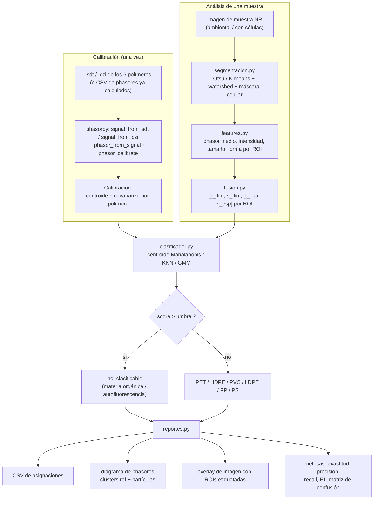

# PIPELINE.md — flujo de datos de napari-mp-classifier

## Estado de implementación por etapa

| Etapa | Módulo | Fase | Estado |
|---|---|---|---|
| Lectura de crudo → phasores por píxel | `io_crudo.py` | 0+ | pendiente (necesita datos reales) |
| Spectral unmixing NR-MP vs autofluorescencia | `desmezcla.py` | 2-3 | pendiente — usa `phasorpy.component` (ver `docs/SPECTRAL_UNMIXING.md`) |
| Calibración (centroide + covarianza) | `calibracion.py` | 1 | **hecho** |
| Clasificación + "no clasificable" | `clasificador.py` | 1 | **hecho** (centroide / KNN / GMM) |
| Métricas estándar | `metricas.py` | 1 | **hecho** |
| Segmentación de ROIs | `segmentacion.py` | 2 | **hecho** (Otsu / K-means FIMAP + watershed + máscara celular; IoU 0,81) |
| Features por ROI | `features.py` | 2 | **hecho** (phasor por ROI + forma + intensidad + dispersión) |
| Métricas de segmentación | `metricas.py` | 2 | **hecho** (IoU, precisión/recall de detección) |
| Fusión FLIM + espectral | `fusion.py` | 3 | **hecho** (`fusionar_por_roi` registrado, `fusionar_por_decision` no registrado) |
| Desmezcla NR-MP vs autofluorescencia | `desmezcla.py` | 3 | **hecho** (envuelve `phasorpy.component`; componente autofluor. sintético hasta tener `.czi`) |
| Pipeline seg→features→clasificación | `pipeline.py` | 3 | **hecho** (`analizar_muestra` → `ResultadoMuestra`) |
| CSV + gráficos + resumen + informe unificado | `reportes.py` | 3 | **hecho** (`generar_reporte`: CSV + métricas + figuras + `resumen_muestra.md`) |
| CLI `classify` | `cli.py` | 3 | **hecho** (sobre `.npz`; `.sdt`/`.czi` esperan `io_crudo`) |
| Plugin napari | `napari_integracion/` | 4 | **hecho** (widget de clasificación + phasor plot con back-projection; entorno `napari-mp-env`, py 3.12) |

## Regla de "no clasificable" (detalle)

Ver docstring de `clasificador.py`. Resumen: una partícula queda `no_clasificable` cuando
su distancia de Mahalanobis al cuadrado al cluster de polímero más cercano supera
`chi2.ppf(confianza, df=n_features)` (con `confianza=0.99` por defecto). El umbral es
**consciente de la dimensión** (2 features para una modalidad, 4 para la fusión
FLIM+espectral), a diferencia de un umbral fijo en σ. Es la barrera contra falsos
positivos por materia orgánica fluorescente (muestras ambientales) y autofluorescencia
celular (monocitos / neutrófilos), y absorbe la deriva por envejecimiento
(Meyers et al. 2024) al bajar `confianza`.
